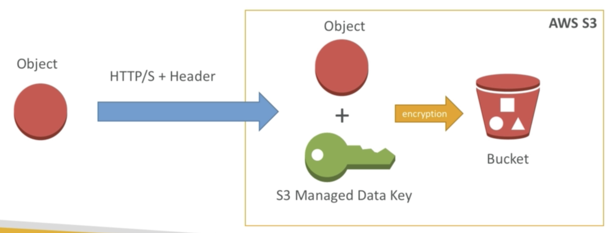
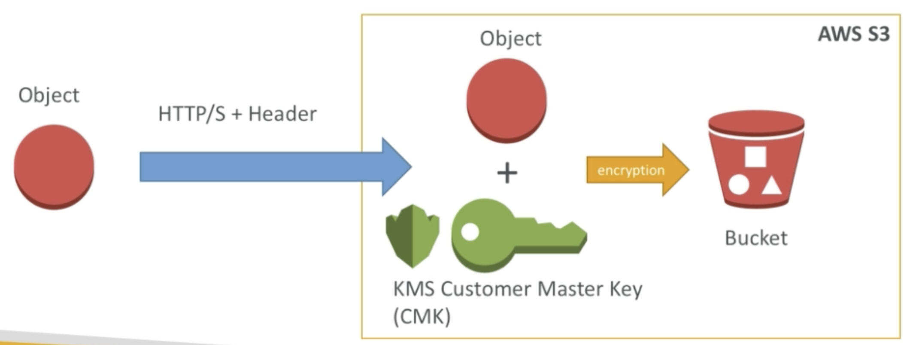
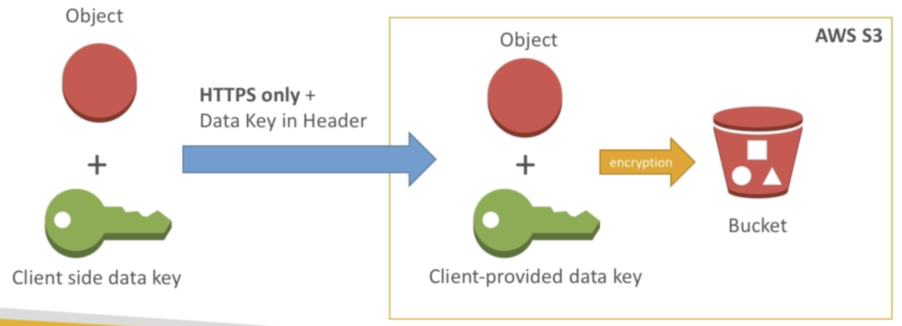
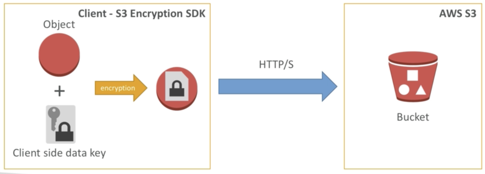

# S3

[S3, IAM, CloudFront, Storage Gateway](https://www.notion.so/S3-IAM-CloudFront-Storage-Gateway-a74c7e11ecce41bf9160f7a521f47392) 

## Encryption in rest

### SSE-S3

- encryption using keys handled & managed by S3
- object is encrypted server side
- AES-256 encryption type
- set header `"x-amz-server-side-encryption": "AES256"`

### SSE-KMS

- encryption using keys handled & managed by KMS
- KMS Advantages: user control + audit trail
- object is encrypted server side
- set header `"x-amz-server-side-encryption": "aws:kms"`

### SSE-C

- encryption using keys handled & managed by client
- object is encrypted server side (S3 use key to encrypt then through key - don't store any things)
- HTTPS must be used
- encryption key must  provided in HTTP headers, for every HTTP request made

### Server side encryption

- client encrypt data before sending to S3
- client decrypt data after retrieving from S3
- client fully manages the keys and encryption cycle

## Encryption in transit (in fly)

use SSL/TLS (https) to access to S3 endpoint

## Bucket policies

- json based:
    - resources: buckets and objects
    - Actions: set of API to Allow or Deny
    - Effect: Allow/ Deny
    - Principal: The account or user to apply the policy to
- use policy to:
    - Grant public access to the bucket
    - force objects to be encrypted at upload

## S3 CORS

- if you host a static website on S3, and you . request data from another S3 bucket, you need enable CORS
- CORS allow you to limit the number of websites that can request your file in S3
- read more: [CORS - Cross Same Origin Policy](https://www.notion.so/CORS-Cross-Same-Origin-Policy-98390b3dd7554abcbad0a53485ee75d9)

## S3 Performance

- it was recommend to have random characters in front of your key name to optimize performance
    - <my_bucket>/**5r4d**_my_folder/my_file1.txt
    - <my_bucket>/**a91e**_my_folder/my_file2.txt
- is was recommend to never to use dates to prefix keys:
    - ~~<my_bucket>/2018_09_09_my_folder/my_file1.txt~~
    - ~~<my_bucket>/2018_09_10_my_folder/my_file2.txt~~
- from 2018/07, up to 3500 RPS for PUT, and 5500 RPS for GET ⇒ don't need to add random characters
- use CloudFront for read
- S3 Transfer Acceleration for write
- If using SSE-KMS encryption, you may be limited to your AWS limits for KMS usage ⇒ increase the KMS limits

## S3 + Glacier Select

- only retrieve some parts of data
- `select * from s3object s where s.\"Country (Name)\" like '%United States%'`
- save cost up to 80% and increase performance up to 400%
- work with files in CSV, JSON, Parquet format
- can be compressed with GZIP or BZIP2
- no sub queries or Join queries