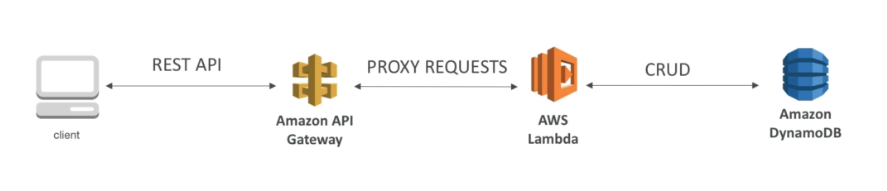
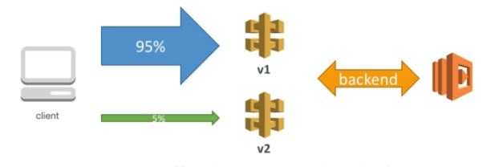
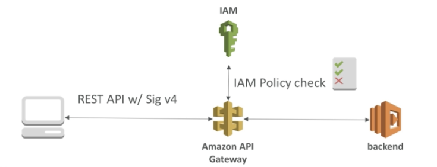
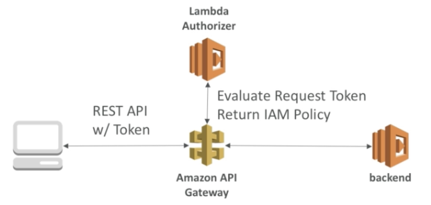
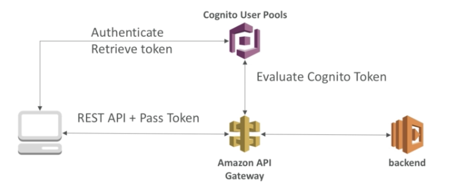

# API Gateway

## Features

- Handle API version
- Handle different environments (dev, test, prod...)
- Handle security (Authentication vs Authorization)
- Create API keys, handle request throttling
- Swagger / Open API import to quickly define APIs
- Transform and validate requests and responses
- Generate SDK and API specifications
- Cache API responses

## Deployment

- Making changes in the API Gateway does not mean they're effective

    ⇒ need to make a "deployment"

- Changes are deployed to "Stages", can use the naming you like for stages (dev, test, prod)
- Each stage has its own configuration parameters
- Stage can be rolled back as a history of deployments is kept
- Stage variables are like environment  variables for API Gateway

### Stage Variables & Lambda Aliases

- create stage variables to indicate the corresponding Lambda alias

### Canary Deployment

- can enable deployments for any stage
- choose the % off traffic the canary channel receives

    ⇒ blue / green deployment with Lambda & Gateway

- metrics & logs are separate ( for better monitoring)
- can override stage variables for canary

## Mapping Templates

- use to modify request / responses
- rename parameters
- modify body content
- add headers
- map JSON to XML
- use Velocity Template Language (VTL)

## Swagger / Open API Integrate

- API deifinition as code
- Import / export existing Swagger / Open API 3.0 spec to API Gateway
    - Method
    - Method Request
    - Integration Request
    - Method Response
    - AWS extensions for API gateway
- written in YAML, JSON
- can generate SDK for our apps

## Caching API responses

- reduce the number of calls made to the backend
- default time TTL is 300 second (5 minutes) (0s - 3600s)
- define per stage
- can encrypt
- cache capacity 0.5GB - 237GB
- can override cache settings for specific methods
- can flush the entire cache
- client can bypass (invalidate) the cache with header: `Cache-Controll: max-age=0` (with proper IAM authorization)

## CORS

- The OPTIONS pre-flight request must contain the following headers:
    - `Access-Control-Allow-Methods`
    - `Access-Control-Allow-Headers`
    - `Access-Control-Allow-Origin`
- CORS can be enabled through the console

## Usage plans & API Keys

- Usage plans:
    - Throttling: set overall capacity and burst capacity
    - Quotas: number of requests made per day / week / month
    - Associate with desired API Stages
- API Keys:
    - Generate one per customer
    - Associate with usage plans
- can track usage for API Keys

## Authentication + Authorization

### IAM

- good for users / roles already within your AWS account
- handle authentication + authorization
- leverages Sig v4

### Lambda Authorizer (Custom Authorizer)

- good for 3rd party tokens (FB, GG...)
- flexible in terms of what IAM policy is returned
- handle authentication + authorization
- pay per lambda invocation

### Cognito User Pool

- manage your own user pool (can be backed by FB, GG...)
- no need to write any custom code
- must implement authorization in the backend (use Federated Identity)

