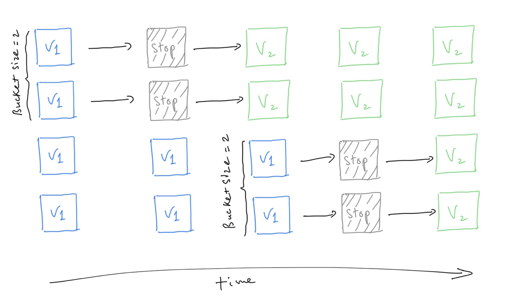
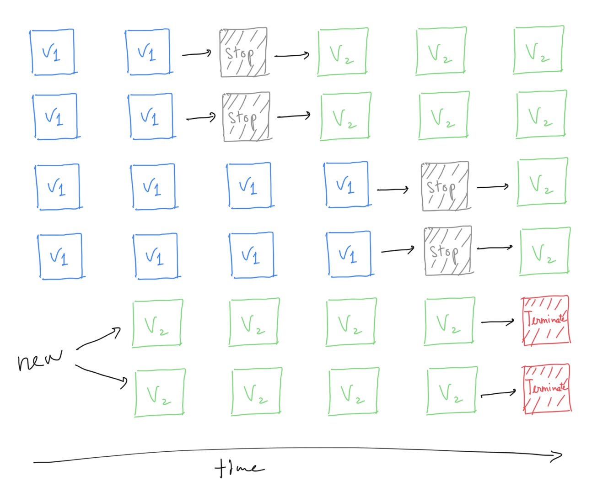
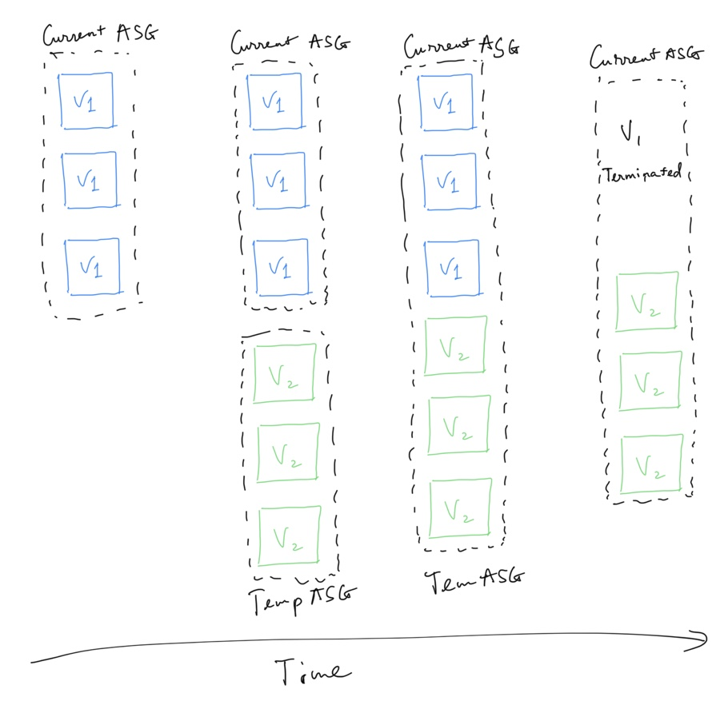
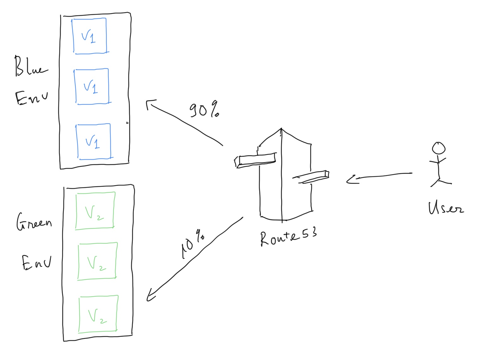
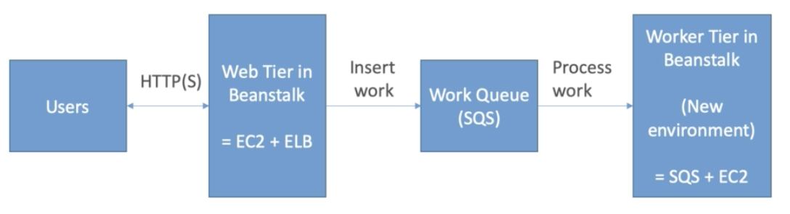

# Beanstalk

## Overview

- managed service
    - instance configuration / OS is handled by beanstalk
    - deployment strategy is configurable but performed by BeanStalk
- just the application code is the responsibility of the developer
- three architecture models:
    - single instance deployment: good for dev
    - LB + ASG: great for production or pre-production web applications
    - ASG only: great for non-web apps in production (workers, etc...)
- include 3 components:
    - application
    - application versin: each deployment gets assigned a version
    - environment name (dev, test, prod...): free naming
- deploy application version to environments and can promote application versions to the next environment
- rollback to previous application version
- full control over lifecycle of environments

## Deployment Strategy

### All at once

- fastest deployment
- application has downtime
- great for quick iterations in development environment
- no additional cost

### Rolling

- application is running below capacity
- can set the bucket size
- application is running both versions simultaneously
- no additional cost
- long deployment

### Rolling with additional batches

- application is running at capacity
- can set the bucket size
- application is running both versions simultaneously
- small additional cost
- additional batch is removed at the end of the deployment
- longer deployment
- good for prod

### Immutable

- zero downtime
- new code is deployed to new instances on a temporary ASG
- high cost, double capacity
- longest deployment
- quick rollback in case of failures (just terminate new ASG)
- great for prod

### Blue / Green

- not a "direct feature" of Beanstalk
- zero downtime and release facility
- create a new "stage" environment and deploy v2 there
- the new environment (green) can be validated independently and roll back if issues
- Route53 can be setup using weighted policies to redirect a little bit of traffic to the stage environment
- Using Beanstalk, "swap URLs" when done with the environment test

## Elastic Beanstalk Extensions

- all the parameters set in the UI can be configured with code using files
- requirements:
    - in the `.ebextensions/` directory in the root of source code
    - YAML/JSON format
    - `*.config` extensions
    - able to modify some default settings using: option_settings
    - ability to add resources such as RDS, ElastiCache, DynamoDB...
- Resources managed by `.ebextensions` get deleted if the environment goes away

## Beanstalk Lifecycle Policy

- Beanstalk can store at most 1000 application versions
- if not remove old versions ⇒ can't deploy anymore
- 2 types of lifecycle policy:
    - based on time (old versions are removed)
    - based on space (when you have too many versions)
- versions that are currently used won't be deleted
- option not to delete the source bundle in S3 to prevent data loss

## Web server vs Worker Environment

- application performs tasks that are long to complete, offload ⇒ use **worker environment**
- decoupling application into 1 tiers is common
- Eg: processing a video, generating a zip file...
- can define periodic tasks in a file cron.yaml

## RDS with Elastic Beanstalk

- RDS provisioned with Beanstalk is great for dev/test
- use separate RDS for production
- migrate from RDS coupled with EB to standalone RDS:
    - take RDS db snapshot
    - enable deletion protection in RDS
    - create a new environment without an RDS, point to existing old RDS
    - perform blue/green deployment and swap new and old environments
    - terminate the old environment (RDS won't get deleted thanks to protection)
    - delete CloudFormation stack (will be in DELETE_FAILED state)

## Tips

- under the hood, Beanstalk relies on CloudFormation
- package code as zip file ⇒ zip file is uploaded to each EC2 machine ⇒ each EC2 machine resolves dependencies ⇒ slow
    - optimization: package dependencies with source code to improve deployment performance and speed
- Beanstalk with HTTPS
    - load the SSL certificate onto the Load Balancer
    - can be done from Console (EB console, load balancer configuration)
    - can be done from the code `.ebextension/securelistener-alb.config`
    - SSL certificate can be provisioned using ACM (AWS certificate manager) or CLI
    - Must configure a security group rule to allow incoming port 443 (HTTPS port)
- Beanstalk redirect HTTP to HTTPS
    - configure instances to redirect HTTP to HTTPS
    - or configure the Application Load Balancer (only) with a rule
    - make sure health checks are not redirected