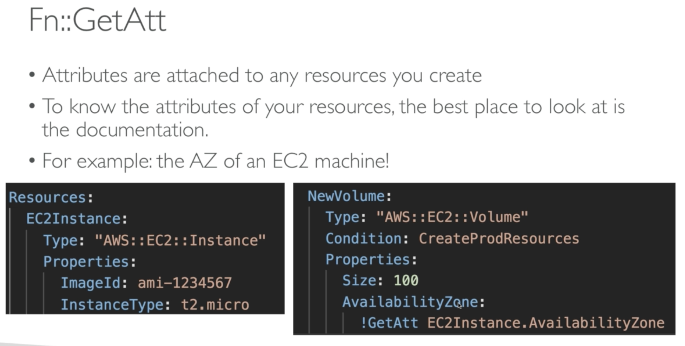

# CloudFormation

## Building Blocks

### Templates components

- Resources: AWS resources declared in the template (can use `!Ref` function to refer to others resources in the same YAML file)
- Parameters: the dynamic inputs (use with `!Ref` function)
- Mappings: the static variables (use with `!FindInMap[ MapName, TopLevelKey, SecondLevelKey ]` function)
- Outputs: export to be used by other stacks (other stacks use `!ImportValue` function to reference). Exported output names must be unique within region
- Conditionals: List of conditions to perform resource creation (`!If`, `!Not`, `!Equal`...)
- Metadata

### Templates helpers:

- References
- Functions

## Rollbacks

- Stack Creation Fails:
    - Default: everything rolls back (gets deleted)
    - Option to disable rollback and troubleshoot what happened
- Stack Update Fails:
    - The stack automatically rolls back to the previous known working state
    - Ability to see in the log what happened and error messages

## Tips:

- Can I create a dynamic amount of resources?
    - No, you can't. Everything in CloudFormation templates has to be declared. Can't perform code generation here
- Is every AWS Service supported in CloudFormation's resources?
    - Almost. Only a select few niches are not there yet
    - You can work around that using AWS Lambda Custom Resources
- Exported output names must be unique within region
- `!GetAtt`

    

- `!Join`
    - want to create "a:b:c" ⇒ `!Join [ ":",  [a, b, c] ]`
- `!Sub`
    - with a Mapping

            Name: !Sub
              - www.${Domain}
              - { Domain: !Ref RootDomainName }

    - without a Mapping

            !Sub 'arn:aws:ec2:${AWS::Region}:${AWS::AccountId}:vpc/${vpc}'