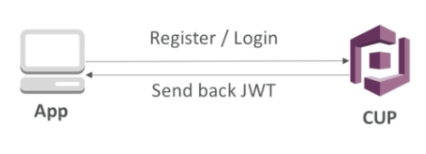
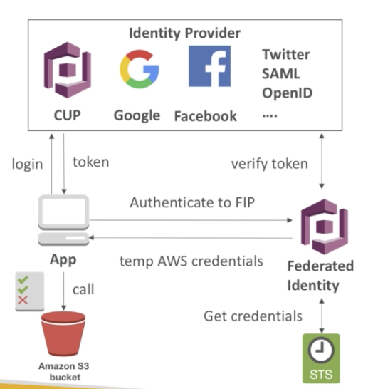

# Cognito

## Cognito User Pools (Authentication)

- For Simple Login function (username/email + password combination)
- create a server less database of user
- can verify emails / phone numbers and add MFA
- can enable Federated Identities (FB, GG, SAML...)
- send back a JWT
- can integrate with API Gateway for authen

## Federated Identity Pools (Authorization)

- provide direct access to AWS Resources from the Client Side
- login to federated identity provider - or remain anonymous
- get temporary AWS credentials back from the Federated Identity Pool - come with a pre-defined IAM policy

## Cognito Sync

- deprecated - use AWS AppSync now
- store preferences, configuration, state of app
- cross device synchronization (any platform - iOS, Android, etc...)
- offline capability (synchronization when back online)
- Require Federated Identity Pool in Cognito (not User Pool)
- Store data in datasets (up to  1MB)
- Up to 20 datasets to synchronise