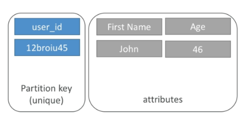
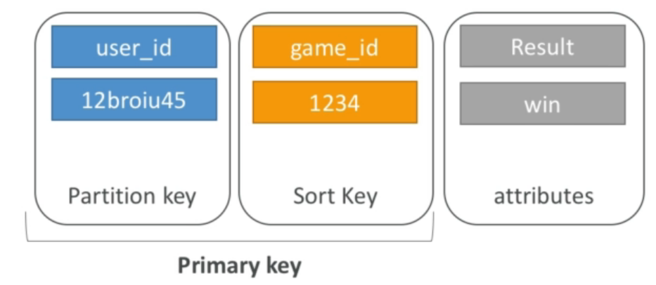
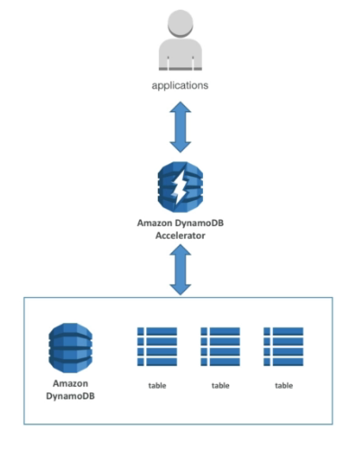

# DynamoDB

## Primary Keys

### Option 1: Partition key only

- partition key must be unique for each item
- partition key must be "diverse" so that the data is distributed
- Example: `user_id` for a users table

    

### Option 2: Partition key + Sort Key

- the combination must be unique
- data is grouped by partition key
- sort key == range key
- Example: users-games table
    - `user_id` for the partition key
    - `game_id` for the sort key

        

## Provisioned Throughput

- Read Capacity Units (RCU): throughput for reads
- Write Capacity Units (WCU): throughput for writes
- Throughput can be exceeded temporarily using "burst credit"
- If burst credit are empty, you'll get a "ProvisionedThroughputException"
- exponential back-off retry

### Write Capacity Units

- **1  WCU = 1 write/second for 1 item up to 1 KB**
- Example:
    - write 10 objects per seconds of 2 KB each ⇒ 2 * 10 = 20 WCU
    - write 6 objects per second of 4.5 KB each ⇒ 6 * 5 = 30 WCU (4.5KB rounded ⇒ 5KB)
    - write 120 objects per minute of 2KB each ⇒ 120 / 6 * 2 = 4 WCU

### Read Capacity Units

- By default: DynamoDB uses Eventually Consistent Reads, but GetItem, Query, Scan provide a "ConsistentRead" parameter you can set to True
- **1 RCU = 1 strongly consistent read / second for 1 item up to 4KB
           = 2 eventually consistent reads / sencond for 1 item up to 4KB**
- Example:
    - 10 strongly consistent reads / seconds of 4 KB each ⇒ 10 * 4 / 4 = 10 RCU
    - 16 eventually consistent reads / seconds of 12 KB each ⇒ 16 / 2 * 12 / 4 = 24 RCU
    - 10 strongly consistent reads / seconds of 6 KB each ⇒ 10 * 8 KB / 4 = 20 RCU (6KB round up 8KB)

### Partitions Internal

- number of partitions:
    - by capacity: (TOTAL RCU / 3000) + (TOTAL WCU / 1000)
    - by size: Total Size / 10 GB
    - total partitions = CEILING(MAX(Capacity, Size))
- WCU and RCU are spread evenly between partitions
- Exceed RCU or WCU ⇒ **ProvisionedThroughputExceededExceptions**

## API

### Write API

- `PutItem`: Write data to DynamoDB (consume WCU)
- `UpdateItem`: Update data in DynamoDB (partial update)
    - can use Atomic Counters and increase them
- `BatchWriteItem`
    - up to 25 `PutItem` or `DeleteItem` in 1 call
    - up to 16 MB of data written
    - up to 400 KB of data per item
    - decrease latency by reducing the number of API calls
    - operations are done in parallel
    - it's possible for part of a batch to fail, can retry
- Conditional Writes: Write/Update only if conditions are respected, otherwise reject
    - deal with concurrent access to items
    - no performance impact

### Delete API

- `DeleteItem`: Delete an individual row
    - can perform a conditional delete
- `DeleteTable`: Delete a whole table and all its items
    - much quicker deletion than calling `DeleteItem` on all Items

### Reading Data

- `GetItem`: Read based on Primary key (HASH or HASH+RANGE)
    - **eventually consistent read by default**, option to use strongly consistent reads
- `ProjectionExpression`: only get certain attributes (save bandwitdth, no change RCU)
- `BatchGetItem`:
    - up to 100 items
    - up to 16 MB of data
    - items are retrieved in parallel

### `Query`

- parameters:
    - PartitionKey - required, `=` operator
    - SortKey - optional, `=, <, <=, >, >=, Between, Begin` operator
    - `FilterExpression` to filter (**client side do this**)
- returns:
    - up to 1 MB data
    - can use `Limit` option
- can do pagination on the results

### `Scan`

- scan entire table
- return up to 1 MB of data
- **inefficient, consume a lot of RCU**
- limit impact using Limit or reduce the size of the result and pause
- for faster performance, use **parallel scans**
    - scan multiple partitions at the same time
    - increase the throughput and RCU consumed
    - limit the impact like normal Scan
- can use `ProjectionExpression` + `FilterExpression`

## Indexes

### Local Secondary Index (LSI)

- alternate range key for table, local to the hash key
- LSI must be defined at table creation time
- up to 5 local secondary index
- throttling:
    - use WCU, RCU of the main table
    - no special throttling considerations

### Global Secondary Index (GSI)

- GSI = new partition key +  optional sort key
- the index is a new "table" and can project attributes on it
    - partition key + sort key of the original table are always projected (`KEYS_ONLY`)
    - extra attributes to project (`INCLUDE`)
    - can use all attrs from main table (`ALL`)
- Must define RCU/WCU
- can add / modify GSI
- throttling:
    - if the writes are throttled on the GSI, then the main table will be throttled
    - even if WCU on the main tables are fine
    - choose your GSI partition key carefully
    - assign WCU carefully

## Concurrency

- feature called "Conditional Update / Delete"
- **optimistic locking**
- ensure an item hasn't change before altering it (race condition)

## DynamoDB Accelerator - DAX

- cache for DynamoDB, solve the Hot Key problem
- don't need to rewrite your apps
- micro second latency  for cached reads & queries
- 5 minutes TTL for cache by default
- MultiAZ

## DynamoDB Streams

- change in DynamoDB (Create, Update, Delete) can end up in a DynamoDB Stream
- This Stream can be read by AWS Lambda, and can:
    - React to changes in real time
    - Analytics
    - Insert into ElasticSearch
- can implement cross region replication using Stream
- only 24 hours of data retention (≠ Kinesis 1 - 7 days)

## TTL (Time to Live)

- automatically delete an item after an expiry date / time
- no extra cost, not use WCU / RCU
- enabled per row (define a TTL column, add a date there)
- typically delete expired items within 48 hours of expiration
- delete items due to TTL are also deleted in GSI / LSI
- use DynamoDB Streams to recover expired items

## DynamoDB CLI

- `--projection-expression`: attributes to retrive
- `--filter-expression`: filter results
- pagination for DynamoDB / S3
    - Optimization
        - `--page-size`: full dataset is still received but API is called many time and request less data (void timeouts) - 3 items but call 3 times and each request receives 1 item
    - pagination
        - `--max-items`: max number of results returned. Returns `NextToken` - 3 items, call once and receives only 1 item
        - `--starting-token`: specify the last received `NextToken` to keep on reading

## Transactions

- like RDBMS transaction
- Ability to Create / Update / Delete multiple rows in different tables at the same time
- do all or nothing
- Write modes: Standard + Transactional
- Read modes: Eventual Consistency, Strong Consistency + Transactional
- consume x2 WCU / RCU

## Security & Others

- Security:
    - VPC Endpoints can access DynamoDB
    - control access by IAM
    - encrypt at rest using KMS
    - encrypt in transit using SSL/TLS
- Backup and Restore
    - Point in time restore like RDS
    - No performance impact
- Global Tables
    - Multi region, fully replicated, high performance
- use Amazon DMS to migrate Mongo, Oracle, MySQL, S3... to DynamoDB
- can launch a local DynamoDB for development purposes