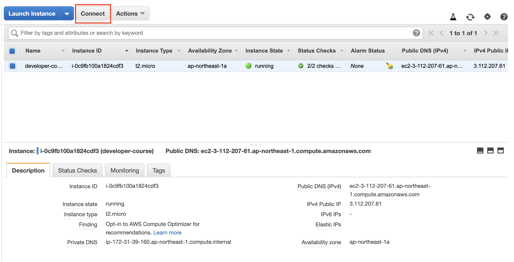
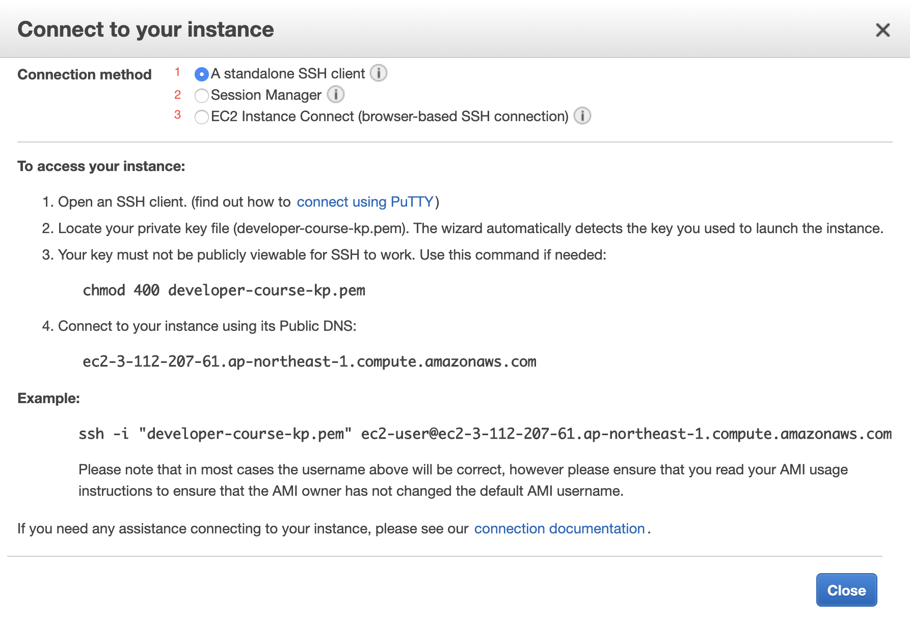
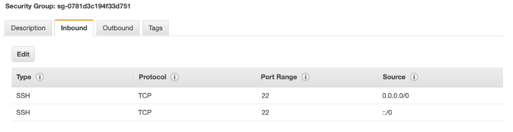
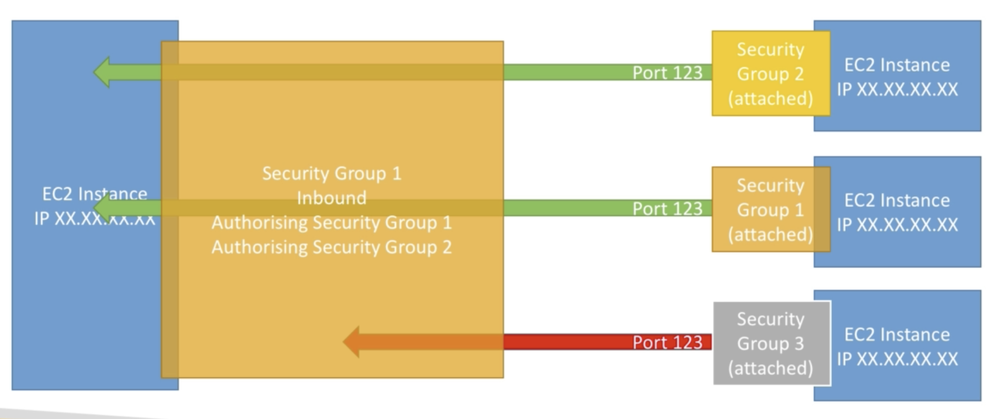

# EC2

## SSH to EC2 instance

Click to `Connect` button

There are 3 ways:

### Use a standalone SSH client

    # use public IP
    ssh -i developer-course-kp.pem ec2-user@3.112.207.61 
    # or use public DNS
    ssh -i developer-course-kp.pem ec2-user@ec2-3-112-207-61.ap-northeast-1.compute.amazonaws.com

## SSH troubleshooting

### There's a connection timeout

This is a security group issue. Any timeout (not just for SSH) is related to security groups or a firewall. Ensure your security group looks like this and correctly assigned to your EC2 instance.

### Permission denied

- You are using the wrong security key or not using a security key. Please look at your EC2 instance configuration to make sure you have assigned the correct key to it.
- You are using the wrong user. Make sure you have started an Amazon Linux 2 EC2 instance, and make sure you're using the user `ec2-user`. This is something you specify when doing `ec2-user@<public-ip>` (ex: `ec2-user@35.180.242.162`) in your SSH command or your Putty configuration
- At the first time SSH to EC2 by key pair, you get this error:

    `Permissions 0644 for 'developer-course-kp.pem' are too open`

    `ec2-user@3.112.207.61: Permission denied`

    ⇒ set `0400` permission for key pair: `chmod 0400 mykeypair.pem`

### I was able to connect yesterday, but today I can't

This is probably because you have stopped your EC2 instance and then started it again today. **When you do so, the public IP of your EC2 instance can change.** Therefore, in your command, or Putty configuration, please make sure to edit and save the new public IP.

## Security Groups

- should maintain one separate security group for SSH access
- time out error ⇒ security group issue
- connection refused error ⇒ it's an application error or it's not launched
- inbound traffic is blocked by default
- outbound traffic is allow by default
- can allow inbound traffic from:
    - anywhere
    - IP
    - other security groups

    

    - prefix lists (???)

## EC2 Instance Launch Types

- On Demand: short workload, predictable pricing
- Reserved Instances: long workloads (≥ 1 year)
- Convertible Reserved Instances: long workloads with flexible instances
- Scheduled Reserved Instances: launch within time window you reserve
- Spot Instances: short workloads, for cheap, can lose instances
- Dedicated Instances: no other customers will share your hardware
- Dedicated Hosts: book an entire physical server, control instance placement