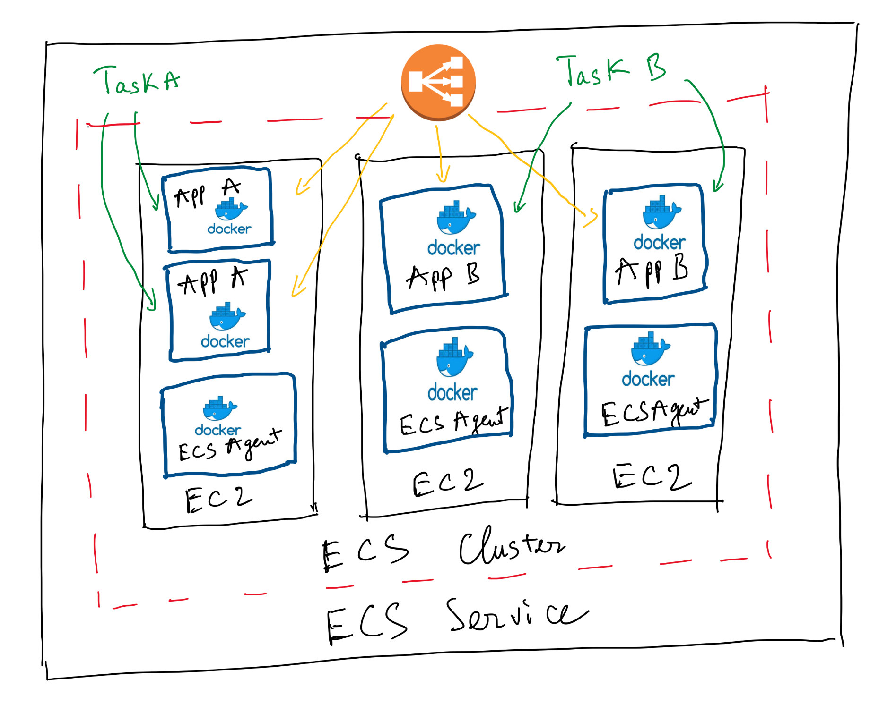
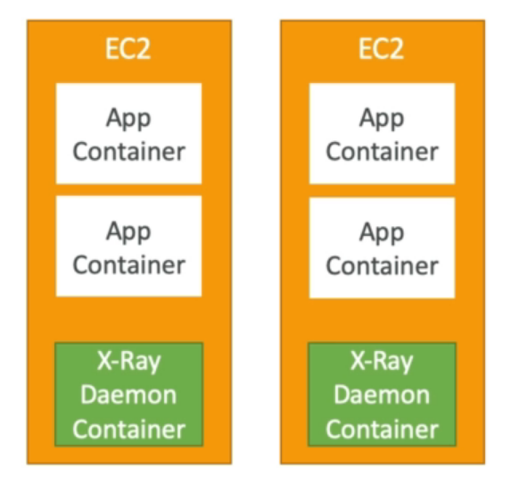
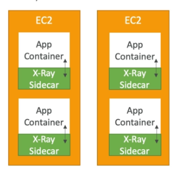
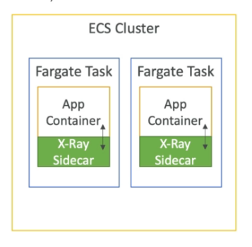
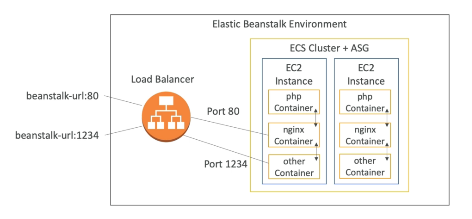

# ECS & ECR & Fargate

## ECS

- used to run Docker containers and has 3 flavors:
    - ECS "Classic": provision EC2 instances to run containers
    - Fargate: ECS serverless, no need to provision EC2
    - EKS: managed Kubernetes by AWS

### ECS Clusters

- logical grouping of EC2 instances
- EC2 instances run the ECS agent (Docker container)
- The ECS agents registers the instance to the ECS cluster
- The ECS instances run a special AMI, made specifically for ECS
- EC2 instances must enable config `ECS_ENABLE_TASK_IAM_ROLE`  in `/etc/ecs/ecs.config` file (automatically setup by ECS)

### ECS Task Definitions

- Tasks definitions are metadata in JSON form to tell ECS how to run a Docker Container
- Information about:
    - Image Name
    - Port Binding for Container and Host
    - Memory and CPU required
    - Environment variables
    - Networking information

### EC2 Service

- ECS Services help define how many tasks should run and how they should be run
- ensure that the number of tasks desired is running across our fleet of EC2 instances
- can be linked to ELB / NLB / ALB

### ECS Service with Load Balancer

- must not specify a host port (only container port)
- use ALB with dynamic port mapping
- EC2 instance security group must allow traffic from the ALB on all ports

## ECR

- private Docker images repository
- access is controlled through IAM
- commands:
    - `$(aws ecr get-login --no-include-email --region eu-west-1)`
    - `docker push[123456789.dkr.ecr.eu-west-1.amazoneaws.com/demo:latest](http://123456789.dkr.ecr.eu-west-1.amazoneaws.com/demo:latest)`
    - `[docker pull 123456789.dkr.ecr.eu-west-1.amazoneaws.com/demo:latest](http://123456789.dkr.ecr.eu-west-1.amazoneaws.com/demo:latest)`

## Fargate

- serverless
- no need provision EC2 instances
- provision the container spec (CPU/RAM)
- just create task definitions, AWS will run our containers
- to scale, just increase the task number

## ECS & X-Ray

- `AWS_XRAY_DAEMON_ADDRESS`: Use this variable if you have configured the daemon to listen on a different port or if it is running on a different host.

### ECS Cluster: X-Ray Container as a Daemon

### ECS Cluster: X-Ray Container as a "Side Car"

### Fargate Cluster: X-Ray Container as a "Side Car"

## Elastic Beanstalk + ECS

- can run Elastic Beanstalk in Single & Multi  Docker Container mode
- Multi Docker helps run multiple containers per EC2 instance in EB
- This will create:
    - ECS Cluster
    - EC2 instances
    - Load Balancer
    - Task definitions and execution
- Require `Dockerrun.aws.json` file at the root of source code
- Docker images must be pre-built and stored in ECR

