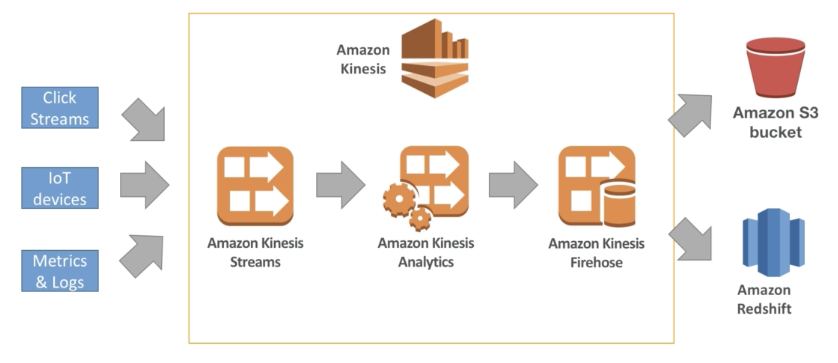
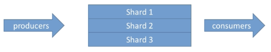
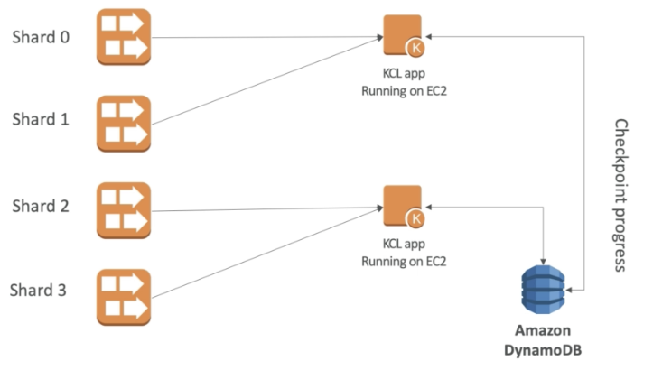
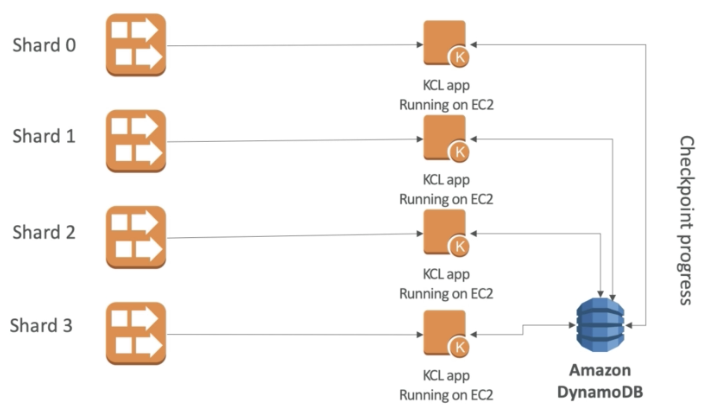

# Kinesis

- data is automatically replicated to 3 AZ
- **Kinesis Streams**: low latency streaming ingest at scale
- **Kinesis Analytics**: perform real-time analytics on streams using SQL
- **Kinesis Firehose:** load streams into S3, Redshift, ElasticSearch

## Kinesis Streams

- streams are divided in ordered Shards / Partitions
- retentions: 1 (default) - 7 days
- ability to reprocess / replay data
- multiple apps can consume the same stream
- real-time processing with scale of throughput
- one data is inserted in Kinesis, it can't be deleted (immutability)

### Shard

- one stream is made of many different shards
- 1MB/s or 1000 messages/s at write PER SHARD
- 2MB/s at read PER SHARD
- billing is per shard provisioned
- batching available or per message calls
- number of shards can change over time (reshard/merge)
- records are ordered **per shard**

### Put records

- data + partition key (message key) ⇒ PutRecord
- partition key to determine shard id
- messages sent get a "sequence number"
- choose a partition key that is highly distributed
    - user_id if many users
    - **Not** country_id if 90% of the users are in one country
    - **Not** date
- use Batching with PutRecords to reduce costs and increase throughput
- **ProvisionedThroughputExceeded** if go over the limits

### Consumers

- can use normal consumer
- can use Kinesis Client Library
    - read record from a Kinesis Streams with distributed apps sharing the read workload (run on EC2, Elastic Beanstalk, on-premise)
    - each shard is be read by only 1 KCL instance
    - means 4 shards = max 4 KCL instances, means 6 shards = max 6 KCL instances
    - progress is check pointed into DynamoDB (need IAM access)

    

    

### Exceptions

- ProvisionedThroughputExceeded: over the limits of any shard
    - make sure don't have a hot shard
    - solutions:
        - retries with backoff
        - increase shards
        - ensure good partition key

## Kinesis Data Analytics

- perform real-time analytics on Kinesis Streams using SQL
- auto scaling
- don't need provision
- can create streams out of the real-time queries (windowed average)
- pay for actual consumption rate

## Kinesis Firehose

- near real time (60s latency)
- load data into Redshift / S3 / ElasticSearch / Splunk
- auto scaling
- don't need provision
- pay for the amount of data going through Firehose

## Security

- control access / authorization using IAM policies
- Encrypt in flight using HTTPS
- Encrypt at rest using KMS
- possible to encrypt / decrypt data client side
- VPC Endpoints available for Kinesis

## SQS vs SNS vs Kinesis

- consumer "pull data"
- data is deleted after being consumed
- can have as many workers (consumers) as we want
- no need to provision throughput
- no ordering guarantee (except FIFO queues)
- individual message delay capability

- push data to many subscribers
- up to 10,000,000 subscribers
- data is not persisted (lost if not delivered)
- Pub/Sub
- Up to 100,000 topics
- No need to provision throughput
- Integrates with SQS for fan-out architecture pattern

- consumers " pull data"
- as many consumers  as we want (1 shard - 1 consumer)
- possible to replay data
- meant for real-time big data, analytics and ETL (IOT)
- ordering at the shard level
- data expires after X days
- must provision throughput