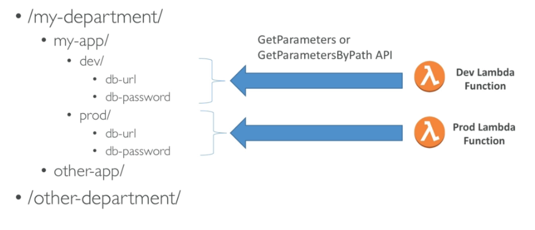

# KMS

## KMS (Key Management Service)

- User can **not** see the key (CMK - Customer Master Key) used to encrypt data, and the CMK can be rotated for extra security
- never store your secrets key in plaintext ⇒ can store encrypted secret key in code / environment variables
- KMS can only help in encrypting up to 4KB of data per call
- if data > 4KB, use envelope encryption (client side encrypt)
- give access to KMS:
    - make sure the Key Policy allows the user
    - make sure the IAM Policy allows call to KMS API
- manage the keys & policies:
    - create
    - rotation policies
    - disable
    - enable
- can audit key usage (using CloudTrail)
- 2 types of CMK:
    - AWS Managed Service Default CMK: free
    - User Keys created in KMS: 1$/month
    - User Keys imported (must be 256-bit symmetric key): 1$/month
- pay for API call to KMS (0.03$ / 10000 calls)

## AWS Encryption SDK

- encrypt over 4KB using KMS
- different from the S3 Encryption SDK
- Encryption SDK = Envelope Encryption = GenerateDataKey API

## AWS Parameter Store

- Systems Manager / Parameter Store UI
- secure storage for configuration and secrets
- encrypt using KMS
- serverless, scalable, durable, easy SDK, free
- version tracking
- manage configuration (who can see, decrypt...) by path & IAM
- notifications with CloudWatch Events
- integration with CloudFormation

