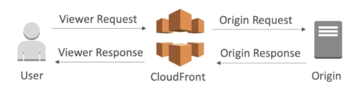
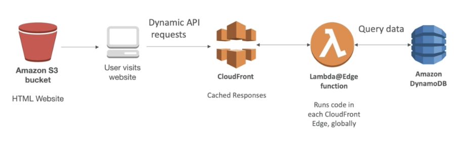

# Lambda

## Overview

- pay per request and compute time

## Configuration

- timeout: default 3 seconds, maximum 15 minutes
- Environment variables
- allocated memory (128MB to 3G)
- ability to deploy within a VPC + assign security groups
- IAM execution role must be attached to the Lambda function
- tracing with AWS X-Ray ⇒ enable active tracing will automatically adds X-Ray permission

## Concurrency and Throttling

- concurrency up to 1000 executions (can increase through ticket) (standard concurrency)
- can set a "reserved concurrency" at the function level (maximum concurrency that function can reach)
- can set "provisioned concurrency"
- each invocation over the concurrency limit will trigger a "Throttle"
- Throttle behavior:
    - if synchronous invocation ⇒ return ThrottleError - 429 (eg: http request)
    - If asynchronous invocation ⇒ retry automatically twice and after all retries, then go to DLQ (eg: S3 trigger)
        - DLQ can be a SNS topic or SQS queue

        ⇒ debug in production

## Limitation

- Execution:
    - Memory allocation: 128MB - 3008MB
    - Maximum execution time: 15 minutes
    - Disk capacity (in `/tmp`): 512MB
    - Concurrency limits: 1000
- Deployment:
    - install the dependencies packages and zip with code
        - libraries need to be compiled on Amazon Linux
    - Lambda function deployment size (compressed): 50MB
        - if > 50MB, use S3
    - Uncompressed deployment: 250MB
    - can use `/tmp` directory to load other file at startup
    - size of environment variables: 4KB

## Versions vs Aliases

### Version

- publish a Lambda function ⇒ create a version
- versions are **immutable**
- versions have their own ARN
- version = code + configuration

### Alias

- aliases are **pointers** to Lambda function versions
- can define a "dev", "test", "prod" aliases and point to different lambda versions
- aliases are **mutable**
- enable Blue / Green deployment by assigning weights to versions
- aliases have their own ARNs

## Using with CloudFormation

- store the Lambda zip in S3
- refer S3 zip location in the CloudFormation code

## `/tmp` space

- use cases:
    - if your Lambda function needs to download a big file to work
    - if your Lambda function needs disk space to perform operations
- max size is 512MB
- The directory content remains when the execution context is frozen, providing transient cache that can be used for multiple invocations
- For persistence of object (non temporary), use S3

## Best practices

- perform heavy-duty work outside of your function handler, function will reuse it
    - connect to databases
    - initialize the AWS SDK
    - pull in dependencies or datasets
- use environment variables
    - database connection string, S3 bucket...
    - password, sensitive value... encrypt using KMS
- minimize deployment package size
    - break down the function
    - the Lambda zip limit
- avoid using recursive code, never have a Lambda function call itself ⇒ the bill will increase
- don't put Lambda function in VPC unless you have to ⇒ initialize speed will increase

Read more: [AWS Serverless Lambda functions best practice](https://www.notion.so/AWS-Serverless-Lambda-functions-best-practice-82bc188d2b634120985ecf18bb99ba91) 

## Lambda@Edge

- use Lambda@Edge deploy Lambda functions alongside your CloudFront CDN

    ⇒ deploy Lambda globally

- can use Lambda to change CloudFront request and responses:
    - after CloudFront receives a request from a viewer (viewer request)
    - before CloudFront forwards the request to the origin (origin request)
    - after CloudFront receives the response from the origin (origin response)
    - before CloudFront forwards the response the the viewer (viewer response

    

    - can generate responses to viewers without ever sending the request to the origin
- global application

    

- Use cases:
    - Website Security and Privacy
    - Dynamic Web App at the Edge
    - Search Engine Optimization (SEO)
    - Intelligently Route Across Origins and Data Centers
    - Bot Mitigation at the Edge
    - Real-time Image Transformation
    - A/B Testing
    - User Authentication, Authorization
    - User Prioritization
    - User Tracking and Analytics