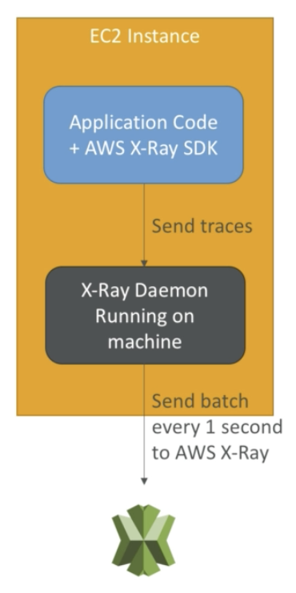

# Monitoring

## CloudWatch

### Metrics: Collect and track key metrics

- **Metric** is a variable to monitor (CPUUtilization, NetworkIn...)
- Metrics belong to **namespaces**
- **Dimension** is an attribute of a metric (instance id, env...)
    - Up to 10 dimensions per metric
- Metric have **timestamps**
- EC2: have metrics "every 5 minutes" by default, detailed monitoring - every 1 minute
- EC2 Memory usage is not pushed by default ( use custom metric)
- Custom Metrics:
    - by default: 1 minute/metric
    - high resolution: up to 1 second/metric (use **StorageResolution** API parameter)
- use API call **PutMetricData**
- use exponential back off in case of throttle errors

### Logs: Collect, monitor, analyze and store log files

- Logs storage architecture:
    - Log groups: arbitrary name, usually representing an application
    - Log stream: instances within application/log files/containers
- can define log expiration policies (never expire - by default, 30 days...)
- using the AWS CLI can tail logs
- sending logs to CloudWatch require IAM permission
- encrypt logs using KMS at Group Level

### Events: Send notifications when certain events happen

- schedule: cron jobs
- even pattern: event rules to react to a service doing something
- triggers to Lambda functions, SQS/SNS/Kinesis Messages
- CloudWatch Event creates a small JSON document to give information about the change

### Alarms: React in real-time to metrics / events

- Alarm States:
    - OK - don't send anything
    - INSUFFICIENT_DATA - not enough data for the alarm
    - ALARM - alarm threshold is being passed
- Period:
    - Length of time in seconds to evaluate the metric
    - High resolution custom metrics: can only choose 10 sec or 30 sec

## X-Ray

- Troubleshooting application performance and errors, find bottlenecks
- Distributed tracing of microservice
- ability to trace:
    - every request
    - sample request (as a % for example or a rate per minute)
- security:
    - IAM for authorization
    - KMS for encryption at rest

### Enable X-Ray

1. import the AWS X-Ray SDK to code
    - application SDK will capture:
        - calls to AWS services
        - HTTP/HTTPS requests
        - Database Calls (MySQL, PostgreSQL, DynamoDB)
        - Queue calls
2. install the X-Ray deamon or enable X-Ray AWS Integration
    - X-RAY deamon works as a low level UDP packet interceptor
    - AWS Lambda/ other AWS services already run the X-Ray deamon for you
    - Each application must have the IAM rights to write data to X-Ray

    

- Enable in Elastic Beanstalk: create file `.ebextensions/xray-daemon.config`

### Troubleshooting

- If X-Ray is not working on EC2
    - Ensure the EC2 IAM Role has the proper permission
    - Ensure the EC2 instance is running the X-Ray Deamon
- to enable on AWS Lambda
    - Ensure it has an IAM execution role with proper policy (AWSX-RayWriteOnlyAcess)
    - Ensure that X-Ray is imported in the code

### Tips

- X-Ray deamon / agent has a config to send traces cross account
- **Segments**: each application / service will send them
- **Trace**: segments collected together to form an end-to-end trace
- **Sampling**: decrease the amount of requests sent to X-Ray, reduce cost
- **Annotaions**: Key Value pairs used to **index** traces and use with filters
- **Metadata**: Key Value pairs, **not index,** not used for searching
- X-Ray on EC2 / on-premise
    - Linux system must run the X-Ray deamon
    - IAM instance role if EC2 or AWS credentials on on-premise instance
- X-Ray on Lambda:
    - Make sure X-Ray integration is ticked on Lambda
    - IAM role is lambda role
- X-Ray on Beanstalk:
    - set configuration on EB console
    - or use beanstalk extension
- X-Ray on ECS / EKS / Fargate
    - create a Docker image that runs the Deamon
    - ensure port mapping & network settings are correct and IAM roles are defined

## CloudTrail:

- Internal monitoring of API calls
- Audit changes to AWS Resources by your users
- enabled by default
- if a resources is deleted in AWS, look into CloudTrail first

## Different

- CloudTrail:
    - **Audit** API calls made by users / services / AWS console
    - useful to detect unauthorized calls or root cause of changes
- CloudWatch
    - monitoring metrics overtime, storing log
- X-Ray
    - for debug
    - automated trace analysis & central service map visualization
    - latency, errors and fault analysis
    - tracking request across distributed systems