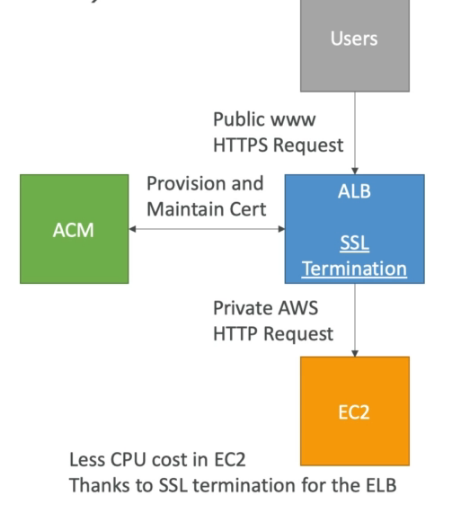

# Other Applications

## CloudFront

- Content Delivery Network (CDN)
- improve read performance, content is cached at the edge
- popular with S3 but works with EC2, Load Balancing
- support RTMP Protocol (videos/media)

## Step Functions

- visual workflow to orchestrate your Lambda functions
- represent flow as a JSON **state machine**
- features: sequence, parallel, conditions, timeouts, error handling...
- maximum execution time of 1 year

## ACM (AWS Certificate Manager)

- to host public SSL cretificates in AWS:
    - Buy your own and upload them using the CLI
    - have ACM provision and renew public SSL certificate for you

Common pattern