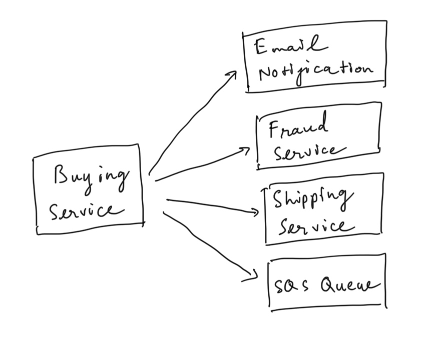
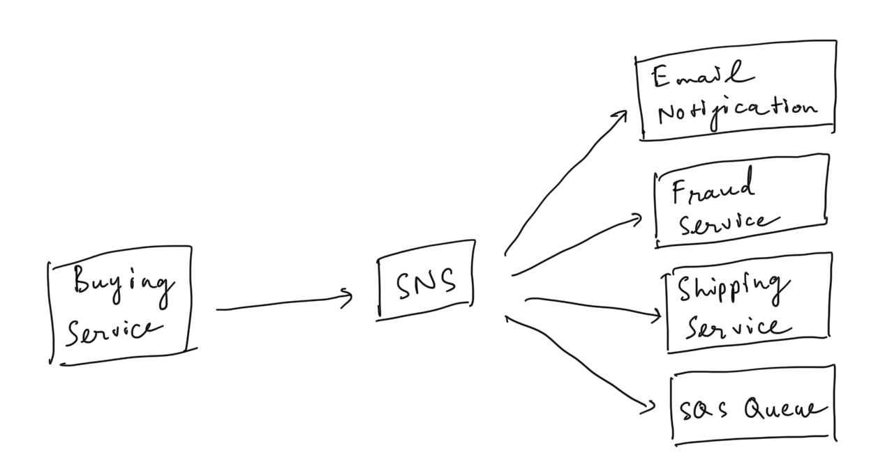
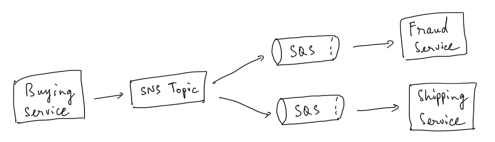

# SNS

- direct integration

    

- Pub / Sub

    

- "event producer" only sends message to one SNS topic
- each subscriber to the topic will get all the messages (new feature to filter messages)
- up to 10,000,000 subscriptions per topic
- 100,000 topics limit
- subscribers can be:
    - SQS
    - HTTP/HTTPS (with delivery retries - how many times)
    - Lambda
    - Emails
    - SMS messages
    - Mobile Notifications
- integrate with other AWS services:
    - CloudWatch (for alarms)
    - ASG notifications
    - S3 (on bucket event)
    - CloudFormation (state change ⇒ failed to build)
    - ...
- Topic Publish (within AWS server - using the SDK)
    - create a topic
    - create a subscription
    - publish to the topic
- direct publish (for mobile apps SDK)
    - create a platform app
    - create a platform endpoint
    - publish to platform endpoint

## SNS + SQS: Fan Out

- push once in SNS, receive in many SQS
- Full decoupled
- No data loss
- Ability to add receivers of data later
- SQS allows for delayed processing
- SQS allows for retries of work

