# SQS

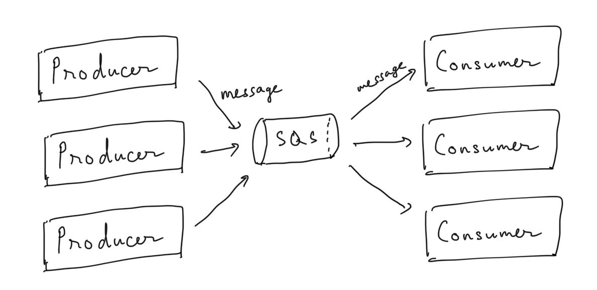

## Application communication

- synchronous communications

    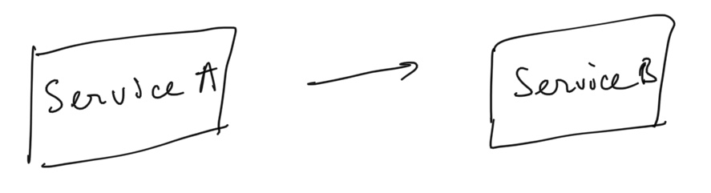

    ⇒ can be problematic if there are sudden spikes of traffic

- asynchronous / event based

    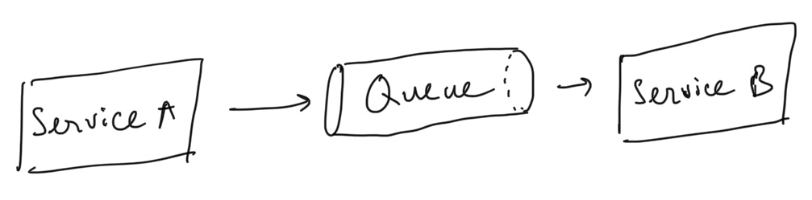

    ⇒ scalable

## Producing messages

- define body
- add message attributes (metadata - optional)
- delay delivery (optional)
- get back
    - message identifier
    - MD5 hash of body

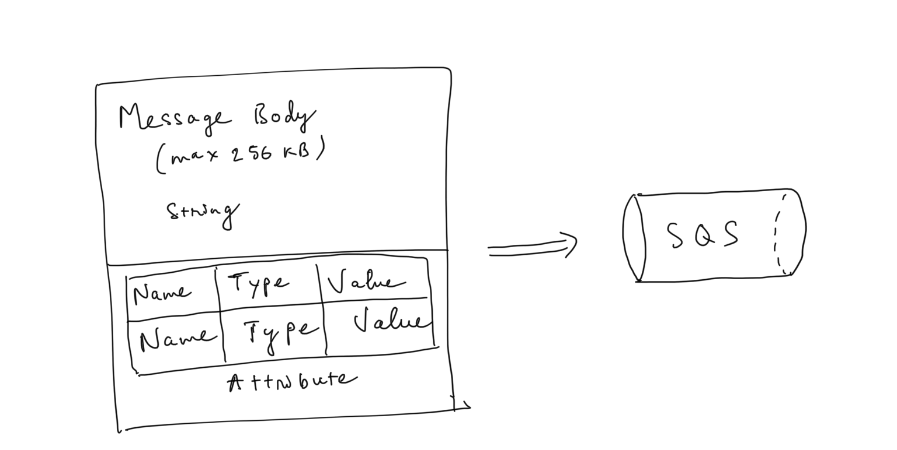

## Consuming messages

- poll message from SQS (maximum 10 messages at a time)
- process the message within the visibility timeout
- delete the message using message ID & receipt handle

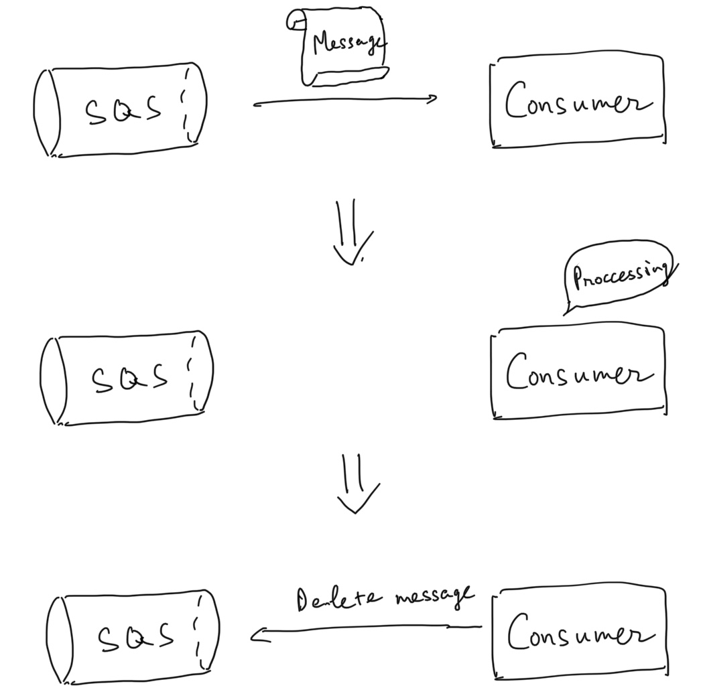

### visibility timeout

- when a consumer polls a message from a queue ⇒ the message is invisible to other consumers for a defined period ⇒ **Visibility Timeout**
    - 0 second - 12 hours (default 30 seconds)
    - when consumer fails to process the message, the message is still invisible until **Visibility Timeout** finish ⇒ be carefull to set high Visibility Timeout (eg 15 minutes)
    - if too low (30 senconds) and consumer needs time to process the message (2 minutes) ⇒ another consumer will receive and process the message more than once
- **ChangeMessageVisibility** API to change the visibility
- **DeleteMessage** API to tell SQS the message was successfully processed

### Long Polling

- when a consumer requests message from the queue, it can optionally "wait" for messages to arrive if there are none in the queue

    ⇒ decrease the number of API call

- wait time between 1 second - 20 second (20 is preferable)
- Long Polling > Short Polling
- enable at queue level or **WaitTimeSeconds** API
- Short polling

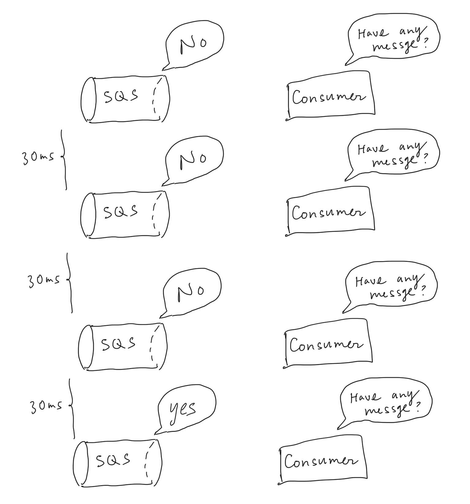

- long polling

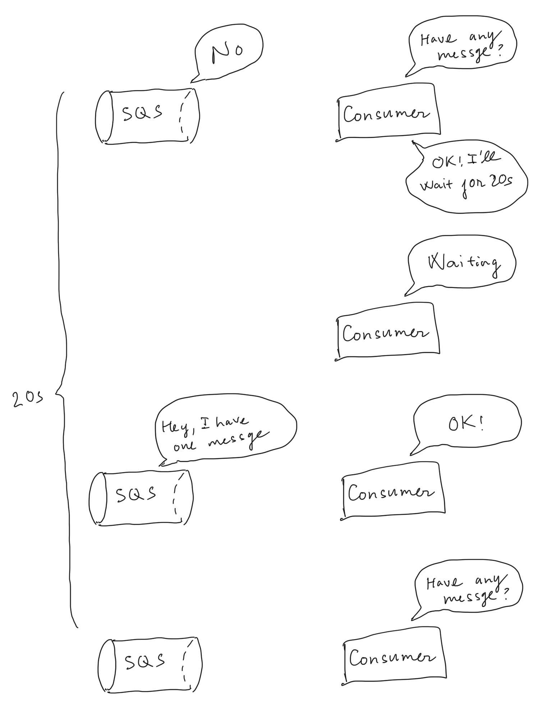

## Standard Queue

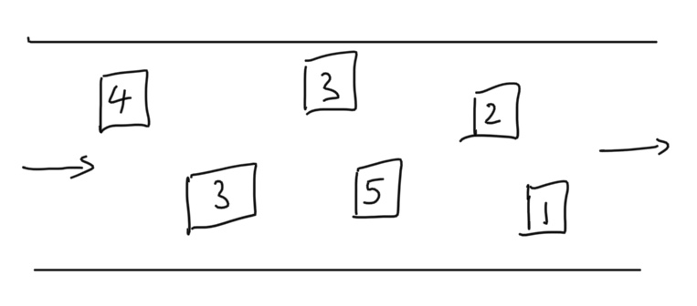

- **unlimited** throughput
- retention 4 days by default, maximum 14 days
- no limit number of messages in the queue
- low latency <10ms
- horizontal scaling in terms of number of consumers
- can have **duplicate** messages (at least once delivery)
- can have **out of order** messages (best-effort ordering)
- limit 256KB per message

### Delay Queue

- delay a message up to 15 minutes (consumers don't see it immediately)
- default is 0 seconds
- can set a default at queue level (per message delay + per queue delay)
- can override the default using the **DelaySeconds** parameter

### Dead Letter Queue

- set threshold of how many times a message can go back to the queue (because of failure process) ⇒ **redrive policy**
- by default DLQ is not enable, messages don't go back the the queue
- after the threshold is exceeded, the message goes into a DLQ

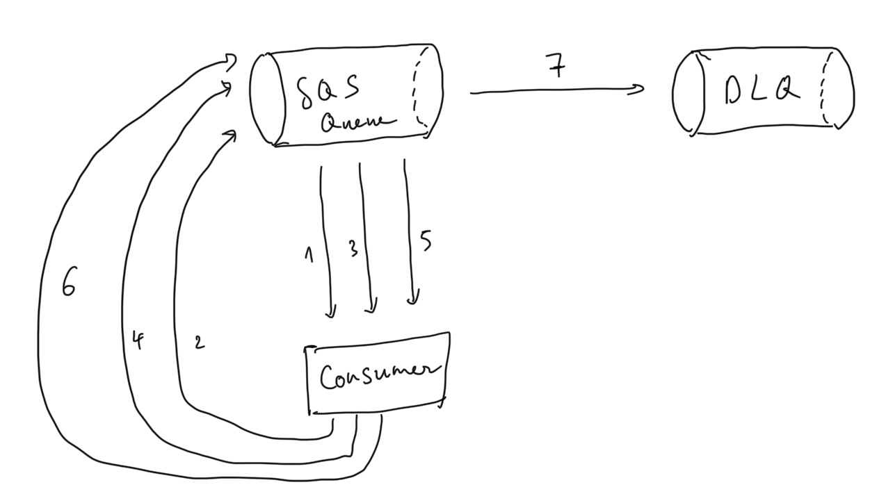

## FIFO Queue

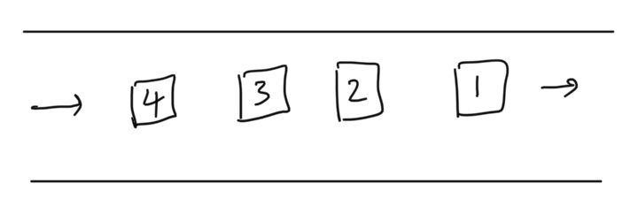

- high throughput (300/s without batching, 3000/s with batching)
- process messages **in order** by the consumer (**sequencing**)
    - specify **MessageGroupId** to ensure ordering
    - messages with different Group ID may be received out of order
    - messages with the same Group ID are delivered to one consumer at a time
- sent messages exactly **once (deduplication)**
    - provide **MessageDeduplicationId** with message
    - content based duplication: **MessageDeduplicationId** is  generated as the SHA-256 of the message body (not attributes)
    - deduplication interval: 5 minutes
- no per message delay (only per **queue delay**)

## SQS Extended Client

- to send messages larger than 256KB ⇒ use the SQS Extended Client

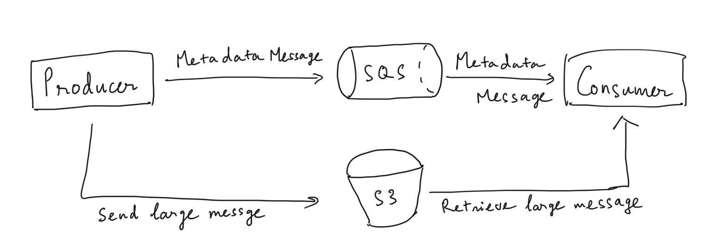

## Security

- encrypt on fly using HTTPS endpoint
- enable SSE using KMS
    - can set CMK (Customer Key)
    - can set encrypt key reuse period (1 minute - 24 hours)
    - only encrypt the body
- SQS queue access policy
    - control over IP
    - control over the time the request come in

API

- CreateQueue, DeleteQueue
- PurgeQueue: delete all messages in queue
- SendMessage, ReceiveMessage, DeleteMessage
- ChangeMessageVisibility: change visibility timeout
- WaitTimeSeconds
- DelaySeconds
- Batch [SendMessage/DeleteMessage/ChangeMessageVisibility]